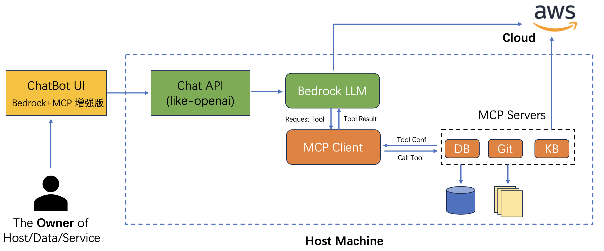
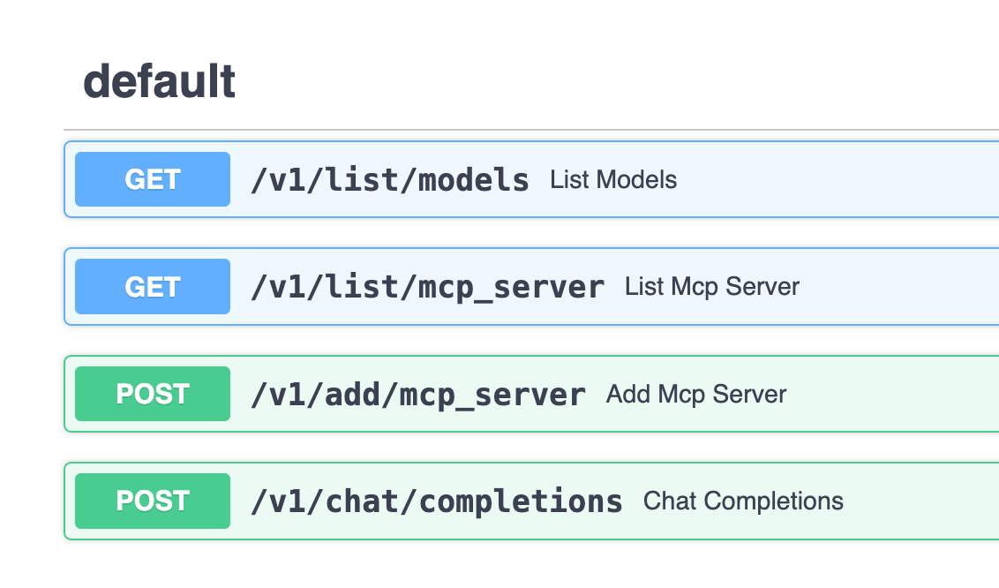

# MCP Client for the ISV Hackathon Prototype

This repository contains an MCP client using the local and Streamable HTTP transports written with the python SDK and the Streamlit package for the frontend, plus the code to be deployed to Amazon ECS.

- The frontend provides a ChatBot interaction service based on Nova, Claude, and other large models in **Bedrock**, while introducing **MCP**, greatly enhancing and extending the application scenarios of ChatBot-form products, supporting seamless integration with local file systems, databases, development tools, internet retrieval, etc. If a ChatBot with a large model is equivalent to a brain, then introducing MCP is like equipping it with arms and legs, truly making the large model move and connect with various existing systems and data.

<!-- - Demo Solution Architecture
 -->

## 1. Project Features:
- Supports both Amazon Nova Pro and Claude Sonnet 3.5 and 4 models
- Fully compatible with Anthropic's official MCP standard, allowing direct use of various [MCP servers](https://github.com/modelcontextprotocol/servers/tree/main) from the community in the same way
- Decouples MCP capabilities from the client, encapsulating MCP capabilities on the server side, providing API services externally, and with chat interfaces compatible with OpenAI for easy integration with other chat clients

- Front-end and back-end separation, both MCP Client and MCP Server can be deployed on the server side, allowing users to interact directly through the backend web service via web browsers, thereby accessing LLM and MCP Server capabilities and resources
- Supports multiple users, user session isolation, and concurrent access.

## 2. Installation Steps

You can install this project either directly on your system or using Docker. Choose the method that best suits your needs.

### 2.1 Local Installation

#### 2.1.1 Dependencies Installation

Currently, mainstream MCP Servers are developed and run on users' PCs based on NodeJS or Python, so users' PCs need to install these dependencies.

#### 2.1.2 NodeJS

[Download and install](https://nodejs.org/en) NodeJS, this project has been thoroughly tested with version `v22.12.0`.

#### 2.1.3 Python

Some MCP Servers are developed based on Python, so users must install [Python](https://www.python.org/downloads/). Additionally, this project's code is also developed based on Python, requiring environment and dependency installation.

First, install the Python package management tool uv, which can be referenced in the [uv](https://docs.astral.sh/uv/getting-started/installation/) official guide. This project has been thoroughly tested with version `v0.5.11`.

#### 2.1.4 Environment Configuration
After downloading and cloning the project, enter the project directory to create a Python virtual environment and install dependencies:
```bash
uv sync
```

At this point, the virtual environment has been created in the `.venv` directory of the project, activate it:
```
source .venv/bin/activate
```

#### 2.1.5 Configuration Editing
Project configuration is written to the `.env` file, which should include the following configuration items (it is recommended to copy `env_dev` and modify it):
```
AWS_ACCESS_KEY_ID=(optional)<your-access-key>
AWS_SECRET_ACCESS_KEY=(optional)<your-secret-key>
AWS_REGION=<your-region>
LOG_DIR=./logs
CHATBOT_SERVICE_PORT=<chatbot-ui-service-port>
MCP_SERVICE_HOST=127.0.0.1
MCP_SERVICE_PORT=<bedrock-mcp-service-port>
API_KEY=<your-new-api-key>
MAX_TURNS=100

# Cognito Configuration (optional)
COGNITO_REGION=us-east-1
COGNITO_USER_POOL_ID=us-east-1_example
COGNITO_APP_CLIENT_ID=your-app-client-id
```

Note: This project uses **AWS Bedrock Nova/Claude** series models, so you need to register and obtain access keys for these services.

### 2.2 Docker Installation (Alternative)

If you prefer using Docker, you can use the provided Dockerfile and docker-compose.yml files to build and run the project in a container.

#### 2.2.1 Prerequisites
- Docker and Docker Compose installed on your system
- AWS credentials with access to Bedrock services

#### 2.2.2 Setup

1. Create a `.env` file in the project root with your AWS credentials:
   ```
   AWS_ACCESS_KEY_ID=your-access-key
   AWS_SECRET_ACCESS_KEY=your-secret-key
   AWS_REGION=your-aws-region
   API_KEY=your-api-key
   ```

#### 2.2.3 Build and Run

Build and start the container:
```bash
docker-compose up -d
```

Access the services:
- ChatBot UI: http://localhost:8502
- API Documentation: http://localhost:7002/docs#/

To view logs:
```bash
docker-compose logs -f
```

To stop the container:
```bash
docker-compose down
```

## 3. Running

### 3.1 This project includes 1 backend service and a Streamlit frontend, with front and back ends connected via REST API:
- **Chat Interface Service (Bedrock+MCP)**, which can provide Chat interfaces externally, host multiple MCP servers, support historical multi-turn conversation input, and response content with tool call intermediate results attached. Currently does not support streaming responses.
- **ChatBot UI**, which communicates with the above Chat interface service, providing multi-turn conversations and MCP management Web UI demonstration services.

### 3.2 Chat Interface Service (Bedrock+MCP)
- The interface service can provide independent APIs externally for integration with other chat clients, achieving decoupling of server-side MCP capabilities and clients.
- You can view the API documentation at http://{ip}:7002/docs#/.


- Edit the configuration file `conf/config.json`, which preset which MCP servers to start. You can edit it to add or modify MCP server parameters.
- For the parameter specifications of each MCP server, refer to the following example:
```
"db_sqlite": {
    "command": "uvx",
    "args": ["mcp-server-sqlite", "--db-path", "./tmp/test.db"],
    "env": {},
    "description": "DB Sqlite CRUD - MCP Server",
    "status": 1
}
```

- Start the service:
```bash
bash start_all.sh
```

- Stop the service:
```bash
bash stop_all.sh
```

- After startup, check the log `logs/start_mcp.log` to confirm there are no errors, then run the test script to check the Chat interface:
```bash
# The script uses Bedrock's Amazon Nova-lite model, which can be changed to others
# Default API key is 123456, please change according to your actual settings
curl http://127.0.0.1:7002/v1/chat/completions \
  -H "Content-Type: application/json" \
  -H "Authorization: Bearer 123456" \
  -H "X-User-ID: user123" \
  -d '{
    "model": "us.amazon.nova-pro-v1:0",
    "mcp_server_ids":["local_fs"],
    "stream":true,
    "messages": [
      {
        "role": "user",
        "content": "list files in current dir"
      }
    ]
  }'
```

### 3.3 ChatBot UI 
After startup, check the log `logs/start_chatbot.log` to confirm there are no errors, then open the [service address](http://localhost:8502/) in a browser to experience the enhanced Bedrock large model ChatBot capabilities with MCP.
Since file system operations, SQLite database, and other MCP Servers are already built-in, you can try asking the following questions consecutively for experience:

```
show all of tables in the db
how many rows in that table
show all of rows in that table
save those rows record into a file, filename is rows.txt
list all of files in the allowed directory
read the content of rows.txt file
```

### 3.4. Adding MCP Servers
Currently, there are two ways to add MCP Servers:
1. Preset in `conf/config.json`, which will load the configured MCP Servers each time the Chat interface service is restarted
2. Add MCP Servers through the ChatBot UI by submitting MCP Server parameters via a form, which is only effective for the current session and will be lost after service restart

Below is a demonstration of how to add an MCP Server through the ChatBot UI, using the Web Search provider [Exa](https://exa.ai/) as an example. The open-source community already has a [MCP Server](https://github.com/exa-labs/exa-mcp-server) available for it.

First, go to the [Exa](https://exa.ai/) official website to register an account and obtain an API Key.
Then click [Add MCP Server], and fill in the following parameters in the pop-up menu and submit:

- For local servers, you can use the MCP JSON configuration in the same format as the Anthropic official
```json
{
  "mcpServers": {
    "exa": {
      "command": "npx",
      "args": ["-y","exa-mcp-server"],
      "env": {
        "EXA_API_KEY": "your-api-key-here"
      }
    }
  }
}
```

- For the remote servers, you can use this format:
```
{
  "mcpServers": {
    "your_server_name": {
      "server_url": "http://your-mcp-server.com/mcp",
      "http_headers": {"Authorization": "Bearer eyJhbG...AxfQ"}
    }
  }
}
```
Now you can see the newly added item in the list of existing MCP Servers, check it to start the MCP Server.

### 3.5 Local testing of Cognito Authentication
To test locally the Cognito Authentication, one can use the Helper Script.
This script handles AWS Cognito authentication, including SECRET_HASH calculation,
and saves the resulting tokens to a temporary file.

Usage:
```
python cognito_auth.py --client-id CLIENT_ID --username USERNAME --password PASSWORD 
                          [--client-secret CLIENT_SECRET] [--region REGION] 
                          [--output-file OUTPUT_FILE]
```
After that, you can append the `id_token` to the streamlit app URL, e.g. `http://localhost:8502/?id_token=...`

## 5. Awesome MCPs
- https://github.com/punkpeye/awesome-mcp-servers
- https://github.com/modelcontextprotocol/servers
- https://www.aimcp.info/en
- https://github.com/cline/mcp-marketplace
- https://github.com/xiehust/sample-mcp-servers
- https://mcp.composio.dev/
- https://smithery.ai/
